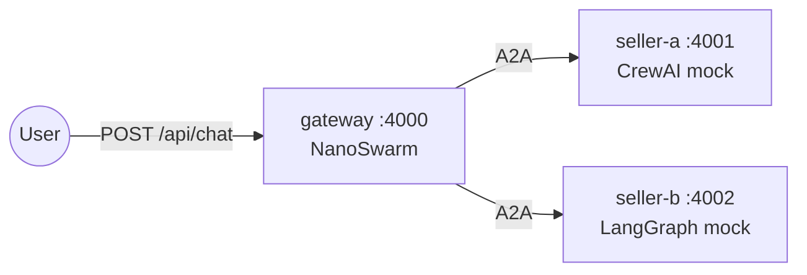

# NanoSwarm

A TypeScript multi-agent swarm framework based on the [Google A2A Protocol](https://github.com/google/A2A).

Built with [Bun](https://bun.sh) and the [Vercel AI SDK](https://sdk.vercel.ai).

## Features

- 10 built-in tools (file read/write/edit, shell exec, web search/fetch, spawn, cron, message)
- Two-layer memory system (MEMORY.md + HISTORY.md) with LLM-driven consolidation
- Subagent spawning for background tasks
- Cron scheduling (at / every / cron expression)
- MCP server integration
- Channel support (CLI, Telegram, REST)
- Bootstrap Files personality system (SOUL.md, AGENTS.md, USER.md, TOOLS.md)
- A2A external agent federation with per-agent endpoints
- Dynamic agent registration API with admin API key authentication
- SSRF protection for web_fetch (private IP blocking + safe redirect following)
- Docker deployment ready

## Supported LLM Providers

NanoSwarm uses the [Vercel AI SDK](https://sdk.vercel.ai) as its LLM abstraction layer. The following providers are supported:

| Provider | Config prefix | Example model |
|----------|--------------|---------------|
| Google Gemini | `gemini/` | `gemini/gemini-3-flash-preview` |
| Anthropic Claude | `anthropic/` | `anthropic/claude-sonnet-4-20250514` |
| OpenAI | `openai/` | `openai/gpt-4o` |

> **Tested:** All integration tests have been verified with **Gemini 3 Flash Preview** (`gemini-3-flash-preview`). Other providers should work but have not been extensively tested.

## Getting Started

### Prerequisites

- [Bun](https://bun.sh) v1.0+

### Install

```bash
bun install
```

### Configure

Create `~/.nanoswarm/config.json`:

```json
{
  "agents": {
    "defaults": {
      "model": "gemini/gemini-3-flash-preview",
      "workspace": "~/.nanoswarm/workspace"
    }
  },
  "providers": {
    "gemini": {
      "apiKey": "YOUR_GEMINI_API_KEY"
    }
  },
  "server": {
    "port": 4000,
    "host": "0.0.0.0",
    "name": "NanoSwarm",
    "adminApiKey": "${ADMIN_API_KEY}"
  },
  "externalAgents": [
    {
      "id": "my-agent",
      "name": "My External Agent",
      "url": "http://localhost:5000/.well-known/agent-card.json"
    }
  ]
}
```

> `workspace` uses `~` which expands to the user's home directory. This works both locally and inside Docker containers.
>
> `adminApiKey` supports `${ENV_VAR}` interpolation. When set, `POST /api/agents/register` and `DELETE /api/agents/:id` require `Authorization: Bearer <key>`.
>
> `externalAgents` registers remote A2A agents at startup. Each agent gets a per-agent endpoint at `/a2a/agents/:id/jsonrpc`.

### Initialize workspace

```bash
bun run cli onboard
```

This generates the Bootstrap Files (SOUL.md, AGENTS.md, etc.) in the default workspace.

### Run

```bash
# Start the A2A gateway server
bun run dev

# Or use the CLI for interactive chat
bun run cli agent
```

## Docker

### Build and run

```bash
# Build the image
docker compose build

# Start the gateway server
docker compose up -d gateway

# Check status
docker compose run --rm cli
```

The gateway listens on port `4000` by default. Override with the `PORT` environment variable.

Config is mounted from `~/.nanoswarm` on the host (override with `NANOSWARM_HOME`).

### Docker Compose services

- **gateway** — A2A HTTP server (always running)
- **cli** — One-off CLI commands (e.g. `docker compose run --rm cli status`)

## Demo: A2A Cross-Framework Shopping

A `docker compose` demo where a NanoSwarm shopping assistant queries two mock seller agents (CrewAI + LangGraph) over A2A protocol.



```bash
# Set up API key
cp demo/.env.example demo/.env   # edit and add GEMINI_API_KEY

# Start all 3 services
make demo-up

# Try a query
curl -X POST http://localhost:4000/api/chat \
  -H "Content-Type: application/json" \
  -d '{"message": "Find me wireless headphones under $300"}'

# Run E2E tests (services must be running)
make demo-test

# Stop
make demo-down
```

See [`demo/README.md`](demo/README.md) for full architecture and verification steps.

## Testing

```bash
# Run all unit tests (no API key needed)
bun test

# Run live integration tests with a real LLM
GEMINI_API_KEY=your_key bun test packages/server/tests/live.test.ts
```

- Unit tests: 464 tests across 57 files, no external dependencies
- Live tests: 15 tests covering file ops, shell exec, multi-turn conversation, memory consolidation, cron, subagent spawning, SOUL.md personality, and error recovery. Gated by `GEMINI_API_KEY` — `bun test` alone will never trigger them.


## Acknowledgements

NanoSwarm was inspired by the architectural concepts of [nanobot](https://github.com/HKUDS/nanobot), particularly its approach to context assembly and tool design.

It is an independent TypeScript implementation exploring these ideas within the [Google A2A Protocol](https://github.com/a2aproject/a2a-js) ecosystem, built with [Bun](https://bun.sh) and the [Vercel AI SDK](https://sdk.vercel.ai).


## License
This project is licensed under the terms of the [Apache 2.0 License](LICENSE).


