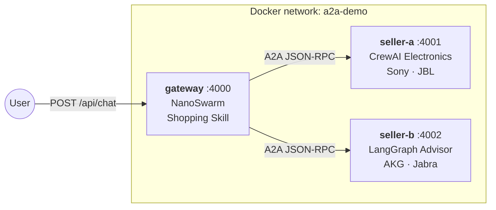
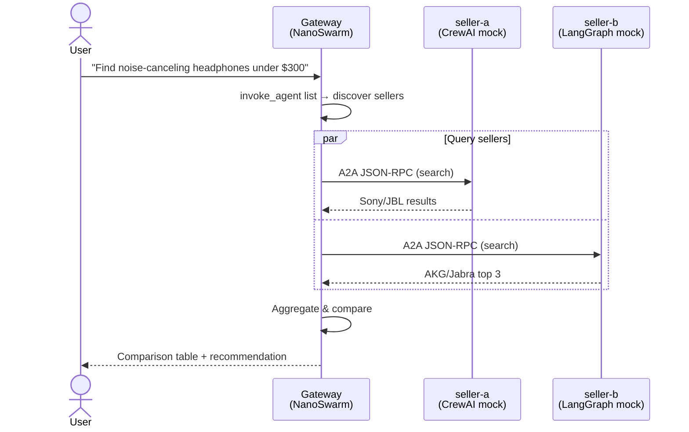

# A2A Cross-Framework Shopping Demo

A complete demo showing NanoSwarm orchestrating multiple A2A-compatible seller agents via the [Google A2A Protocol](https://github.com/google/A2A).

## Architecture



| Service | Framework | Products | Port |
|---------|-----------|----------|------|
| **gateway** | NanoSwarm (Gemini LLM) | — | 4000 |
| **seller-a** | "CrewAI" mock | Sony WH/WF series, JBL Tour/Live/Tune | 4001 |
| **seller-b** | "LangGraph" mock | AKG N9/K371/N700, Jabra Elite series | 4002 |

## Prerequisites

- Docker & Docker Compose
- A Gemini API key ([get one here](https://aistudio.google.com/apikey))

## Quick Start

```bash
# From the repo root:

# 1. Set up API key
cp demo/.env.example demo/.env
# Edit demo/.env and add your GEMINI_API_KEY

# 2. Start all services
make demo-up

# 3. Stop
make demo-down
```

Or without Make:

```bash
docker compose -f demo/docker-compose.yml up --build
```

## Verification

```bash
# Seller health
curl http://localhost:4001/health
curl http://localhost:4002/health

# Agent cards
curl http://localhost:4001/.well-known/agent-card.json | jq .name
curl http://localhost:4002/.well-known/agent-card.json | jq .name

# Gateway sees external agents
curl http://localhost:4000/api/agents | jq

# Shopping query
curl -X POST http://localhost:4000/api/chat \
  -H "Content-Type: application/json" \
  -d '{"message": "Find me wireless noise-canceling headphones under $300"}'
```

Expected: the gateway agent queries both sellers over A2A, then returns a comparison table of Sony/JBL + AKG/Jabra products.

## How It Works



## Cleanup

```bash
make demo-down

# Or: docker compose -f demo/docker-compose.yml down
```
